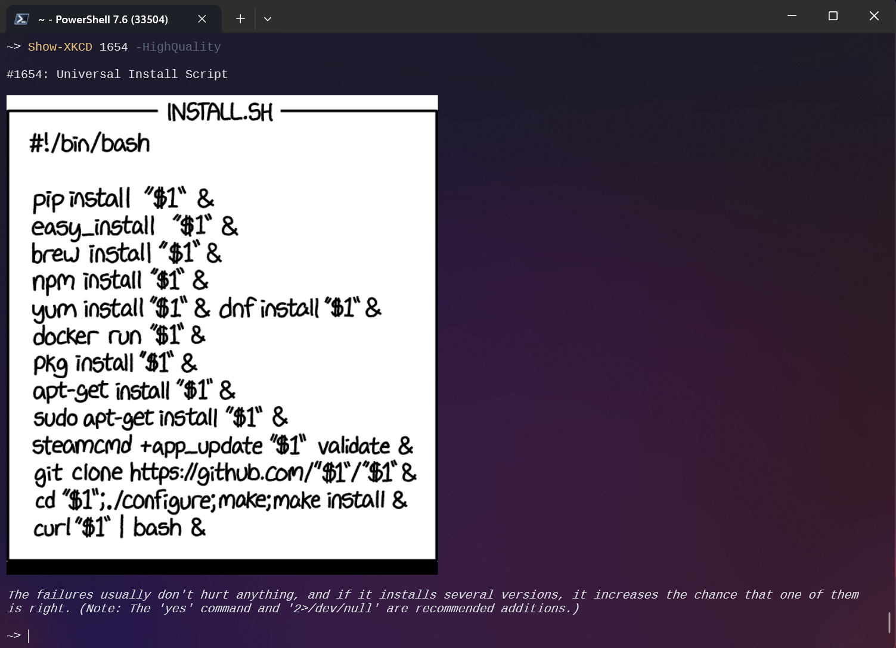

# Powershell-XKCD

[](https://dev.azure.com/markwragg/GitHub/_build/latest?definitionId=9&branchName=master) 

A PowerShell function for accessing the XKCD API to get the details of and (optionally) download the excellent webcomics @ https://xkcd.com.

## XKCD

XKCD is a webcomic by Randall Munroe. Please respect the license of his work as described here: https://xkcd.com/license.html.

## Requirements

- The API provided by xkcd.com must be functional: https://xkcd.com/json.html
- This script requires PowerShell 3.0 or above.

## Installation

This module is published in the PowerShell Gallery as [XKCD](https://www.powershellgallery.com/packages/XKCD/1.4.36.0) so if you have PowerShell 5 or the Package Management modules, it can be installed by entering the following in a PowerShell window:

```
Install-Module -Name XKCD
```

## Usage Examples

1) `Get-XKCD`

By default (and with no specified parameters) the function will return a PowerShell object with the details of the latest webcomic. For example:

```
month      : 1
num        : 1786
link       :
year       : 2017
news       :
safe_title : Trash
transcript :
alt        : Plus, time's all weird in there, so most of it probably broke down and decomposed hundreds of years ago. Which reminds me, I've been meaning to get in touch
             with Yucca Mountain to see if they're interested in a partnership.
img        : https://imgs.xkcd.com/comics/trash.png
title      : Trash
day        : 16
```

2) `Get-XKCD 1` or `Get-XKCD -num 1`

Specify the number of specific comic/s you want to access via the -num parameter (this is a positional parameter so it doesn't need to be explicitly used).

3) `Get-XKCD -Random` or `Get-XKCD -Random -Min 1 -Max 10`

Use the -Random switch to get a Random comic. Optionally specify Min and Max if you want to restrict the randomisation to a specific range of comic numbers.

4) `Get-XKCD -Newest 5`

Use the -Newest switch to get a specified number of the newest comics. Note this cannot be used with -Random (and vice versa).

5) `Get-XKCD 1,5,10` or `10..20 | Get-XKCD`

The number parameter accepts array input and pipeline input, so you can use either to return a specific selection in one hit.

6) `Get-XKCD -Download` or `Get-XKCD 1337 -Download -Path C:\XKCD`

Use the -Download switch to download the image/s of the returned comics. Optionally specify a path to download to, by default it uses the current directory. Note you can use -Download and -Path with any of the other parameters.

7) `1..10 | % { Get-XKCD -Random -min 1 -max 100 | select num,img } | FT -AutoSize`

This calls Get-XKCD 10 times in a foreach loop, returning the number and image URL of 10 random comics from the first 100 comics and presenting them as an autosized table.

8) `Get-XKCD -Show` or `Show-XKCD`

Displays the comic's title, image, and alt text directly in the console instead of returning the comic object. The image is only rendered if your terminal supports the Sixel, Kitty, or iTerm2 inline image graphics protocol; otherwise you'll still see the title and alt text.



9) `Show-XKCD 2000` or `Get-XKCD -Random | Show-XKCD`

Show-XKCD accepts the same -Num parameter as Get-XKCD (and defaults to the latest comic if not specified), and can also take a comic object via the pipeline, e.g. from Get-XKCD or Find-XKCD.

10) `Find-XKCD -Query 'Spider'`

Searches comic titles for the specified text and returns any matches. This builds a local cache of the comic data on first use (and refreshes it automatically if it's out of date), so subsequent searches are fast. Add -FullSearch to match against the whole comic object (e.g. the alt text and transcript) instead of just the title.

11) `'romance','math' | Find-XKCD | Group-Object query`

Find-XKCD accepts multiple queries via the pipeline, and tags each result with a `query` NoteProperty so you can group or filter the combined results by search term.

```
Count Name                      Group
----- ----                      -----
    8 math                      {@{month=4; num=410; link=; year=2008; news=; safe_title=Math Paper; transcript=Lecture…
    1 romance                   {@{month=7; num=919; link=; year=2011; news=; safe_title=Tween Bromance; transcript={{T…
```

12) `Find-XKCD -Query 'Spider' | Get-XKCD -Open` or `Find-XKCD -Query 'Spider' | Get-XKCD -Show`

Find-XKCD's results can be piped straight into Get-XKCD, e.g. to open matching comics in your browser or display them in the console.

13) `Update-XKCDCache`

Creates the local comic cache used by Find-XKCD and Get-XKCDCache if it doesn't already exist, or refreshes it with any comics published since it was last updated. Find-XKCD refreshes this cache automatically, so you don't usually need to run this yourself -- unless you're using Get-XKCDCache, which only warns if the cache is out of date rather than refreshing it for you.

14) `Get-XKCDCache` or `Get-XKCDCache -Num 4,5,6`

Returns comics straight from the local cache instead of querying the API for each one, so it's a much faster way to work with comics you've already cached. With no parameters it returns every cached comic; use -Num (or pipe comic numbers in) to return specific ones.

15) `Get-XKCDCache | Where-Object year -eq 2010`

Because Get-XKCDCache returns the whole local cache as objects, you can use Where-Object, Sort-Object, Group-Object etc. to query across every comic at once, e.g. to find every comic published in a given year.

## Contributions

Code contributions via issues and/or pull requests are welcomed, see [CONTRIBUTING.md](CONTRIBUTING.md) for further guidance.
