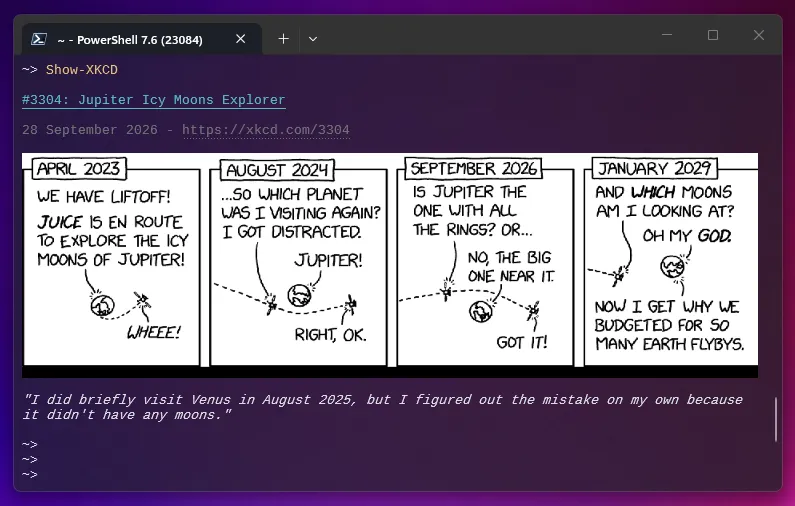
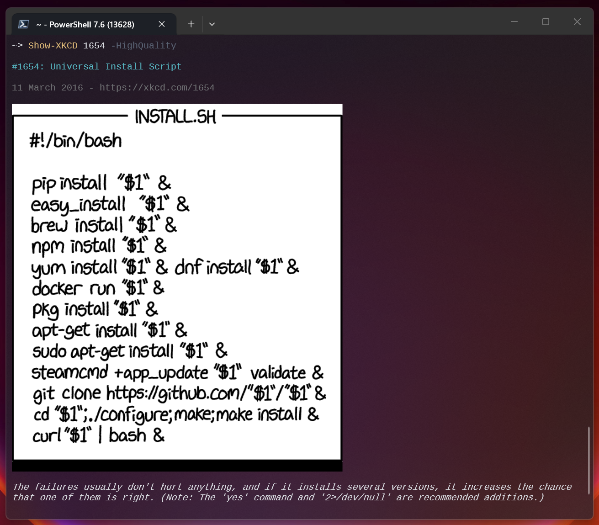
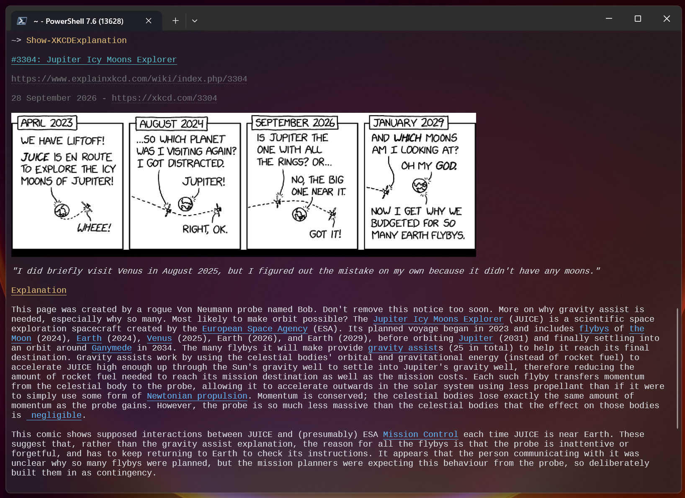

# Powershell-XKCD

[](https://dev.azure.com/markwragg/GitHub/_build/latest?definitionId=9&branchName=master) 

PowerShell cmdlets that wrap the XKCD API (https://xkcd.com/json.html) to return details for the excellent webcomics @ https://xkcd.com. Modern Terminals can view the comic directly in the terminal (on Windows, Linux and MacOS where supported), or you can download the comic image or open the URL via your default browser.




Additionally, community XKCD comic explanations can be accessed from the https://www.explainxkcd.com/ wiki. Modern Terminals can also display these directly in the terminal, with limited formatting.

## XKCD

XKCD is a webcomic by Randall Munroe. Please respect the license of his work as described here: https://xkcd.com/license.html.

## Requirements

- The API provided by xkcd.com must be functional (for comics): https://xkcd.com/json.html
- The API provided by explainxkcd.com must be functional (for explanations): https://www.explainxkcd.com/wiki/api.php
- PowerShell 3.0 or newer.
- A modern terminal, is required to view comics directly from the command-line. Supported terminals include Windows Terminal, VSCode, iTerm2 and Kitty, or any terminal that can render Sixel.

## Installation

This module is published in the PowerShell Gallery as [XKCD](https://www.powershellgallery.com/packages/XKCD) so if you have PowerShell 5+ or the Package Management modules, it can be installed by entering the following in a PowerShell window:

```powershell
Install-Module -Name XKCD
```

Or:

```powershell
Install-PSResource -Name XKCD
```

## Usage Examples

1) `Get-XKCD`

By default (and with no specified parameters) the function will return a PowerShell object with the details of the latest webcomic. For example:

```powershell
Get-XKCD
```

```
Num      : 3304
Title    : Jupiter Icy Moons Explorer
Date     : 2026-09-28
Alt      : "I did briefly visit Venus in August 2025, but I figured out the mistake on my own because it didn't have any moons."
Img      : https://imgs.xkcd.com/comics/jupiter_icy_moons_explorer.png
Html Img : 
Html     : <a href="https://xkcd.com/3304"></a>
```

Note that by default this does not display all of the available properties. To see all of the object properties returned, use `Get-XKCD | FL *`.

2) `Get-XKCD 1` or `Get-XKCD -num 1`

Specify the number of specific comic/s you want to access via the -num parameter (this is a positional parameter so it doesn't need to be explicitly used).

3) `Get-XKCD -Random` or `Get-XKCD -Random -Min 1 -Max 10`

Use the -Random switch to get a Random comic. Optionally specify Min and Max if you want to restrict the randomisation to a specific range of comic numbers.

4) `Get-XKCD -Newest 5`

Use the -Newest switch to get a specified number of the newest comics. Note this cannot be used with -Random (and vice versa).

5) `Get-XKCD 1,5,10` or `10..20 | Get-XKCD`

The number parameter accepts array input and pipeline input, so you can use either to return a specific selection in one hit.

6) `Get-XKCD -Download` or `Get-XKCD 1337 -Download -Path C:\XKCD`

Use the -Download switch to download the image/s of the returned comics. Optionally specify a path to download to, by default it uses the current directory. Note you can use -Download and -Path with any of the other parameters.

7) `1..10 | % { Get-XKCD -Random -min 1 -max 100 | select num,img } | FT -AutoSize`

This calls Get-XKCD 10 times in a foreach loop, returning the number and image URL of 10 random comics from the first 100 comics and presenting them as an autosized table.

8) `Get-XKCD -Raw`

By default, Get-XKCD adds a few extra properties to the comic object it returns: `date` (a `[datetime]` combining day/month/year, so results can be sorted or filtered by date), and `html_img`/`html` (ready-made HTML for embedding the comic, e.g. in an email or web page). Use -Raw to instead get the comic object exactly as returned by the xkcd API, without these additions.

9) `Get-XKCD -Show` or `Show-XKCD`

Displays the comic's title, publish date, a hyperlink to it on xkcd.com, image, and alt text directly in the console instead of returning the comic object. The image is only rendered if your terminal supports the Sixel, Kitty, or iTerm2 inline image graphics protocol; otherwise you'll still see the rest. On Sixel terminals, a warning is shown first if the image is unusually large, since rendering it may take a noticeable while.



10) `Show-XKCD -Next` or `Get-XKCD -Previous`

Any comic returned or displayed by Get-XKCD or Show-XKCD -- the default latest comic, -Num, -Random, -Newest, or a previous -Next/-Previous -- is recorded as the one to page from next. Use -Next and -Previous to page through comics one at a time from wherever you left off, in either direction, without needing to know the comic number -- e.g. `Show-XKCD -Next` repeatedly steps forward one comic at a time, and -Previous steps back. This is tracked separately from the record Test-XKCD uses to report new comics, so paging backwards with -Previous doesn't affect that count. -Next returns/displays nothing once you reach the latest comic, and -Previous returns/displays nothing once you reach comic #1.

If you want to look up a comic with Get-XKCD without moving this marker -- e.g. checking a specific comic out of curiosity, without losing your place -- add the `-NoStateUpdate` parameter.

11) `Show-XKCD 2000` or `Get-XKCD -Random | Show-XKCD`

Show-XKCD accepts the same -Num parameter as Get-XKCD (and defaults to the latest comic if not specified), and can also take a comic object via the pipeline, e.g. from Get-XKCD or Find-XKCD.

12) `Find-XKCD -Query 'Spider'`

Searches comic titles for the specified text and returns any matches. This builds a local cache of the comic data on first use (and refreshes it automatically if it's out of date), so subsequent searches are fast. Add -FullSearch to match against the whole comic object (e.g. the alt text and transcript) instead of just the title.

```powershell
Find-XKCD -Query 'Time' -And 'Machine'
```

```
Num    Date       Title                                         Img
---    ----       -----                                         ---
716    2010-03-19 Time Machine                                  https://imgs.xkcd.com/comics/time_machine.png
1203   2013-04-24 Time Machines                                 https://imgs.xkcd.com/comics/time_machines.png
3251   2026-05-27 Time Machine Conversation                     https://imgs.xkcd.com/comics/time_machine_conversation.png
```

```powershell
Find-XKCD -Query 'Time' -And 'Machine' -FullSearch
```

```
Num    Date       Title                                         Img
---    ----       -----                                         ---
102    2006-05-15 Back to the Future                            https://imgs.xkcd.com/comics/back_to_the_future.jpg
242    2007-03-30 The Difference                                https://imgs.xkcd.com/comics/the_difference.png
337    2007-11-02 Post Office Showdown                          https://imgs.xkcd.com/comics/post_office_showdown.png
350    2007-11-28 Network                                       https://imgs.xkcd.com/comics/network.png
423    2008-05-14 Finish Line                                   https://imgs.xkcd.com/comics/finish_line.png
567    2009-04-10 Urgent Mission                                https://imgs.xkcd.com/comics/urgent_mission.png
591    2009-06-01 Troll Slayer                                  https://imgs.xkcd.com/comics/troll_slayer.png
683    2010-01-01 Science Montage                               https://imgs.xkcd.com/comics/science_montage.png
716    2010-03-19 Time Machine                                  https://imgs.xkcd.com/comics/time_machine.png
799    2010-09-29 Stephen Hawking                               https://imgs.xkcd.com/comics/stephen_hawking.png
821    2010-11-19 Five-Minute Comics: Part 3                    https://imgs.xkcd.com/comics/five_minute_comics_part_3.png
856    2011-02-04 Trochee Fixation                              https://imgs.xkcd.com/comics/trochee_fixation.png
887    2011-04-18 Future Timeline                               https://imgs.xkcd.com/comics/future_timeline.png
1037   2012-04-01 Umwelt                                        https://imgs.xkcd.com/comics/reviews.png
1063   2012-06-01 Kill Hitler                                   https://imgs.xkcd.com/comics/kill_hitler.png
1203   2013-04-24 Time Machines                                 https://imgs.xkcd.com/comics/time_machines.png
1227   2013-06-19 The Pace of Modern Life                       https://imgs.xkcd.com/comics/the_pace_of_modern_life.png
1467   2014-12-31 Email                                         https://imgs.xkcd.com/comics/email.png
1619   2015-12-21 Watson Medical Algorithm                      https://imgs.xkcd.com/comics/watson_medical_algorithm.png
1838   2017-05-17 Machine Learning                              https://imgs.xkcd.com/comics/machine_learning.png
1891   2017-09-18 Obsolete Technology                           https://imgs.xkcd.com/comics/obsolete_technology.png
3251   2026-05-27 Time Machine Conversation                     https://imgs.xkcd.com/comics/time_machine_conversation.png
```

13) `'romance','math' | Find-XKCD | Group-Object query`

Find-XKCD accepts multiple queries via the pipeline, and tags each result with a `query` NoteProperty so you can group or filter the combined results by search term.

```
Count Name                      Group
----- ----                      -----
    8 math                      {@{month=4; num=410; link=; year=2008; news=; safe_title=Math Paper; transcript=Lecture…
    1 romance                   {@{month=7; num=919; link=; year=2011; news=; safe_title=Tween Bromance; transcript={{T…
```

14) `Find-XKCD -Query 'Spider','Robot'` or `Find-XKCD -Query 'Time' -And 'Machine'`

-Query also accepts an array directly, matching a comic if it contains ANY of the given terms -- e.g. `Find-XKCD -Query 'Spider','Robot'` returns comics with 'Spider' OR 'Robot' in the title, as one combined result set (as opposed to piping the terms in separately, which returns the same comics but as if you'd run two separate searches). Add -Or for further alternatives alongside -Query, -And for term(s) that must ALL also be present, or -Not for term(s) that must NONE be present -- e.g. `Find-XKCD -Query 'Time' -And 'Machine'` only matches comics containing both, and `Find-XKCD -Query 'Spider' -Not 'Man'` matches comics with 'Spider' but excludes any that also have 'Man' in the title. Each result's `query` property reflects exactly which term(s) it actually matched -- the -Query/-Or term(s), plus any -And terms (which are always part of the match) -- not just whatever was passed in, and never including -Not terms.

```powershell
Find-XKCD -Query 'Time' -And 'Machine'
```

```
Num    Date       Title                                         Img
---    ----       -----                                         ---
716    2010-03-19 Time Machine                                  https://imgs.xkcd.com/comics/time_machine.png
1203   2013-04-24 Time Machines                                 https://imgs.xkcd.com/comics/time_machines.png
3251   2026-05-27 Time Machine Conversation                     https://imgs.xkcd.com/comics/time_machine_conversation.png
```

15) `Find-XKCD -Query 'Spider' | Get-XKCD -Open` or `Find-XKCD -Query 'Spider' | Get-XKCD -Show`

Find-XKCD's results can be piped straight into Get-XKCD, e.g. to open matching comics in your browser or display them in the console.

16) `Update-XKCDCache`

Creates the local comic cache used by Find-XKCD and Get-XKCDCache if it doesn't already exist, or refreshes it with any comics published since it was last updated. Find-XKCD refreshes this cache automatically, so you don't usually need to run this yourself -- unless you're using Get-XKCDCache, which only warns if the cache is out of date rather than refreshing it for you.

17) `Get-XKCDCache` or `Get-XKCDCache -Num 4,5,6`

Returns comics straight from the local cache instead of querying the API for each one, so it's a much faster way to work with comics you've already cached. With no parameters it returns every cached comic; use -Num (or pipe comic numbers in) to return specific ones.

18) `Get-XKCDCache | Where-Object year -eq 2010`

Because Get-XKCDCache returns the whole local cache as objects, you can use Where-Object, Sort-Object, Group-Object etc. to query across every comic at once, e.g. to find every comic published in a given year.

19) `Get-XKCDCache -Year 2010` or `Find-XKCD -Query 'Spider' -Month 10 -Day 31`

Both Get-XKCDCache and Find-XKCD also accept -Year, -Month and/or -Day directly, to restrict results to comics published in the given year(s), month(s) (1-12) and/or day(s) of the month, without needing a separate Where-Object. They can be combined, and used alongside each cmdlet's other filters (-Num on Get-XKCDCache; the text search and -Or/-And/-Not on Find-XKCD).

20) `Test-XKCD`, `Test-XKCD -Quiet` or `Test-XKCD -Detailed`

Checks whether any new comics have been published since you last viewed one with Show-XKCD or Get-XKCD -Show. By default it writes a friendly message to the console, e.g. `3 new XKCD comics available! The latest is #3290, published 26 August 2026.`. Add -Quiet to instead return `$true` or `$false`, or -Detailed to get a PSCustomObject reporting how many new comics are available and the last viewed vs latest comic numbers. Test-XKCD only reads the local record of the most recently viewed comic -- it never updates it. Use -Num to instead test whether a specific numbered comic exists, e.g. `Test-XKCD -Num 999999` returns `$false`.

```powershell
 if (Test-XKCD -Quiet) { Test-XKCD }
```

If new comics are available, this will write a friendly message to the console stating how many new comics are available (if any) and the publish date of the latest one, where determinable.

Add this to your PowerShell `profile.ps1` to have it run automatically when you open a new session and prompt you only when new comics are available -- or just run `Test-XKCD -AddToProfile` to add it for you, which creates the profile file (and its containing directory) if either doesn't already exist, and does nothing if the line is already there. Run `Test-XKCD -RemoveFromProfile` to remove it again.

21) `Get-XKCDExplanation` or `Get-XKCDExplanation 2000`

Gets the explanation of a comic from the [explain xkcd](https://www.explainxkcd.com/) wiki, using its MediaWiki API. Returns an object with the comic's number, title, explain xkcd URL, and its "Explanation" as plain text (the site's wiki markup is stripped out for readability) -- by default that's the only section retrieved. Add -Transcript and/or -Discussion (reader comments, from its explain xkcd talk page) to also retrieve those, or -Full for all three, e.g. `(Get-XKCDExplanation 2000 -Transcript).Transcript`. By default it returns the explanation of the latest comic; use -Num to request specific comics, which -- like Get-XKCD -- also accepts array and pipeline input. Get-XKCDExplanation also supports the same -Random (-Min/-Max), -Newest, and -Open/-Force parameters as Get-XKCD, e.g. `Get-XKCDExplanation -Random -Min 1 -Max 100` or `Get-XKCDExplanation -Newest 5`.

22) `Get-XKCDExplanation -Show` or `Show-XKCDExplanation`

Displays the comic's title, a hyperlink to its explain xkcd page, publish date, a hyperlink to it on xkcd.com, image, alt text, and explanation directly in the console instead of returning the explanation object. The image is only rendered if your terminal supports the Sixel, Kitty, or iTerm2 inline image graphics protocol; otherwise you'll still see the rest. Bold and italic text is rendered as such, any code formatting in the explanation (e.g. `` `print("hi")` `` -- including plain indented code samples, which explain xkcd also renders as code) is highlighted, and both external links and links to other explain xkcd pages are rendered as working hyperlinks on the linked words themselves, without printing the url.

23) `Show-XKCDExplanation 2000` or `Get-XKCD -Random | Show-XKCDExplanation`

Show-XKCDExplanation accepts the same -Num parameter as Get-XKCDExplanation (and defaults to the latest comic if not specified), and can also take a comic object via the pipeline, e.g. from Get-XKCD or Find-XKCD.



24) `Get-XKCDExplanation -Show -Explanation`, `-Transcript`, `-Discussion`, or `-Full`

Use -Explanation, -Transcript, and/or -Discussion to display exactly the section(s) you want -- e.g. `-Transcript` on its own displays just the transcript, not the explanation -- each under its own heading. Combine them to display more than one, or use -Full to always display all three. By default (no switches) just the explanation is shown. -Explanation, -Transcript, and -Discussion display text only, without fetching or showing the comic image -- the title and a link to the explanation are still shown; -Full always shows the comic image alongside every section. These switches (and the same ones on Show-XKCDExplanation, e.g. `Show-XKCDExplanation 2000 -Full`) also control which sections Get-XKCDExplanation fetches in the first place, so displaying (or returning) just one section skips the API calls for the others.

25) `Get-XKCD -Explain` or `Get-XKCD 2000 -Explain`

Use the -Explain switch to display a comic's explanation via Show-XKCDExplanation instead of returning the comic object, without needing to call Show-XKCDExplanation separately.

26) `Set-XKCDDefault -HighQuality` or `Set-XKCDDefault -Path C:\XKCD`

Saves default preferences that other cmdlets in this module then use automatically, so you don't need to repeat the same parameters every time. Supported preferences: `-HighQuality` (Get-XKCD, Show-XKCD, Get-XKCDExplanation, Show-XKCDExplanation, Export-XKCDTerminalImage), `-Path` (Get-XKCD -Download, Export-XKCDTerminalImage), `-FullSearch` (Find-XKCD), `-CachePath` (Update-XKCDCache, Get-XKCDCache, Find-XKCD), `-StatePath` (Show-XKCD, Get-XKCD -Show/-Next/-Previous, Test-XKCD), and `-Explanation`, `-Transcript`, `-Discussion` and `-Full` (Get-XKCDExplanation, Show-XKCDExplanation). Only the preferences you specify are changed; explicitly passing a parameter on a cmdlet always overrides the saved default. Use `-Reset` to remove all saved preferences.

27) `Get-XKCDDefault`

Returns the default preferences currently saved by Set-XKCDDefault.

28) `Export-XKCDTerminalImage` or `Export-XKCDTerminalImage 353 -Path C:\XKCD`

Renders a comic using whichever inline graphics protocol your terminal supports and saves it to a file (as `<num>.xkcdterm.json`), alongside every field Get-XKCD returns for that comic, so it can be redisplayed instantly later -- via Import-XKCDTerminalImage or Show-XKCD -Path -- without needing network access or having to regenerate the image again (which for Sixel in particular can take a while for large images). Throws if the destination file already exists; use -Force to overwrite it.

29) `Import-XKCDTerminalImage -Path .\353.xkcdterm.json` or `Export-XKCDTerminalImage 353 -PassThru | Import-XKCDTerminalImage`

Writes just the saved image from a file created by Export-XKCDTerminalImage straight to the console, without fetching or re-rendering anything. Warns (but still displays it) if the saved image's graphics protocol doesn't match the one detected for your terminal.

30) `Show-XKCD -Path .\353.xkcdterm.json` or `Export-XKCDTerminalImage 353 -PassThru | Show-XKCD`

Displays the full comic -- title, image, and alt text -- from a file created by Export-XKCDTerminalImage instead of fetching it from the xkcd API, e.g. to view a comic offline. As with Import-XKCDTerminalImage, a warning is shown if the saved protocol doesn't match your terminal's.

## Contributions

Code contributions via issues and/or pull requests are welcomed, see [CONTRIBUTING.md](CONTRIBUTING.md) for further guidance.
